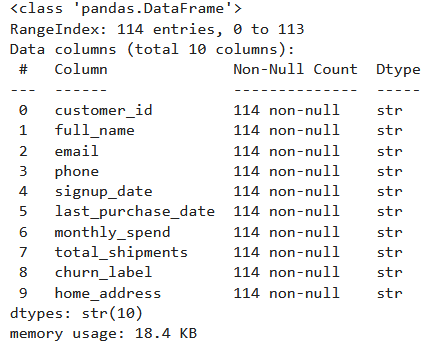
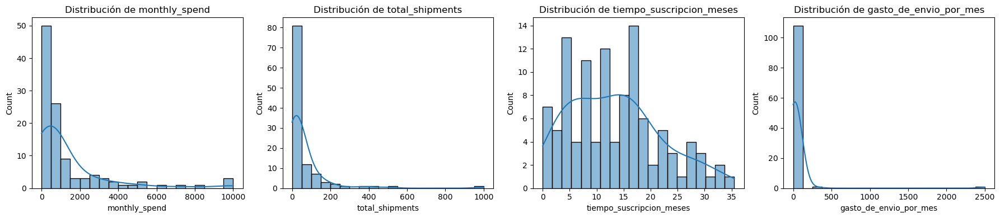
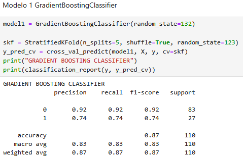
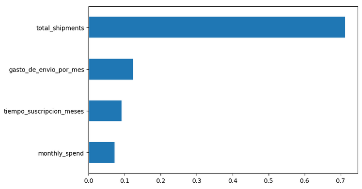
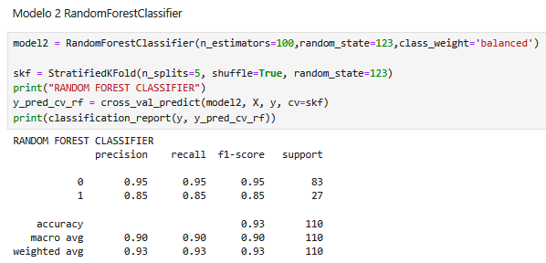

# Predicción de Churn de Clientes

## Descripción
Proyecto de machine learning para predecir churn (deserción) de clientes a partir de ténicas de machine learning desarrollado en Python.

## Objetivo
Reducir el churn de clientes e identificar las causas que lo genenran.

---
## Metodología
### Preprocesamiento
- Fuente datos:raw_data_customers.csv, consta de 114 registros y 10 varibles. En términos generales se tienen variables que caracterizan a los clientes como por ejemplo fecha de inscripción, fecha de última compra, gasto mensual, total de envíos y la variable churn (con valores de 1: desertó y 0: no desertó).

  
- Limpieza de valores nulos: Se realizó limpieza de valores adicionando 0 las variables monthly_spend y total_shipments. Además, aquellso registros que reportaban con valor de 99999 fue reemplazado por 0.
- Imputación de datos: La variable Churn evidenció un registro nulo, el cual fue reemplazado por el estadístico de moda.
- Transfomación de datos: Las variables de fecha signup_date y last_purchase_date se les realizó un procesamiento para estandarizar fechas en el formato YYYY-MM-DD. Por último, las variables monthly_spend y total_shipments se transformó con valor absoluto con el fin de arrelgar los valores negativos.
- Creación de variables derivadas: se crearon las variables de "tiempo_suscripcion_meses" y gasto_de_envio_por_mes. 

-Análisis exploratorio de datos:

Las variables numéricas 'monthly_spend', 'total_shipments', 'tiempo_suscripcion_meses','gasto_de_envio_por_mes' al ser graficadas mediante un histograma evidenciaron una posible distribución no normal, como tambíen una gran presencia de valores atípicos y extremos, como se muestra a continuación:

- Separación de variables X e y.

---

### 🤖 Modelos utilizados
- Gradient Boosting.
  
AAAAAAAAAAAAAAAAAAAAAAAAAAAAAAAAAAAAAAAAAAAA

EEEEEEEEEEEEEEEEEEEEEEEEEEEEEEEEEE

- Random Forest
  
IIIIIIIIIIIIIIIIIIIIIIIII

OOOOOOOOOOOOOOOOOOOOOOOOOOOO

- Regresión logística (balanced)

Se utilizó validación cruzada estratificada debido al desbalance de clases.

---

###  Resultados
- El mejor modelo fue Random Forest debido a su equilibrio entre recall y F1-score.

---

##  Cómo ejecutar
pip install -r requirements.txt  
jupyter notebook P_Inter.ipynb
