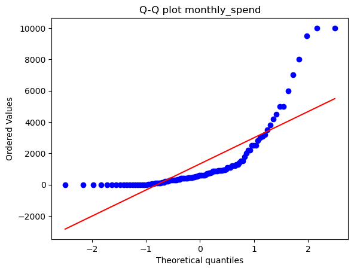
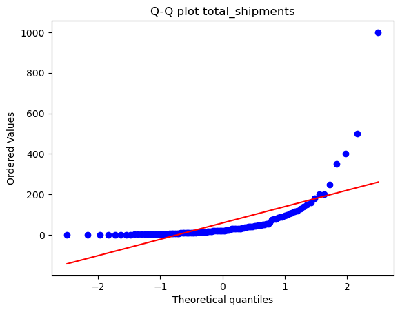
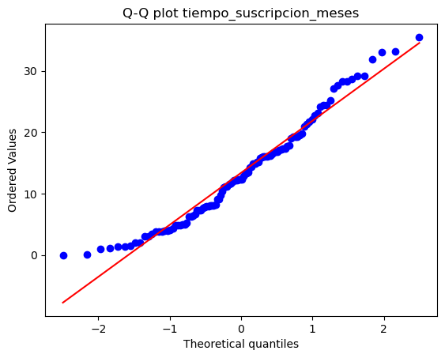
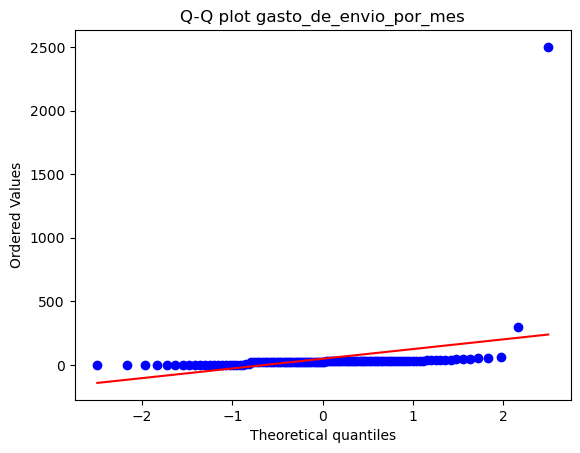
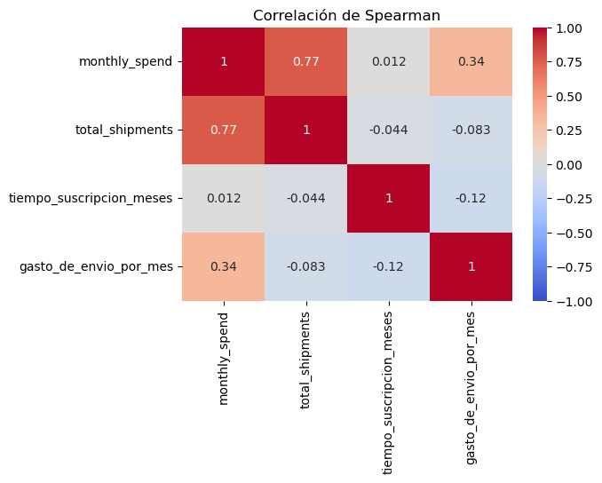
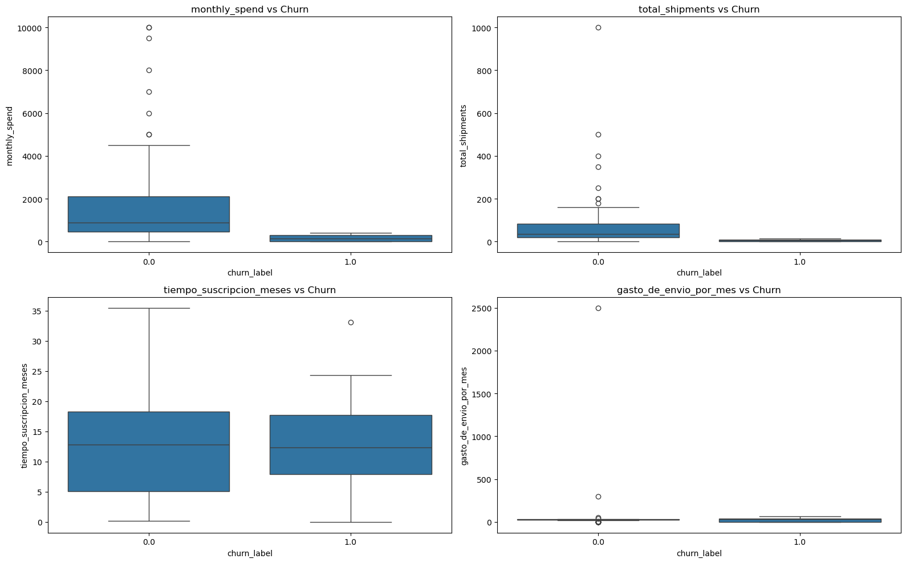
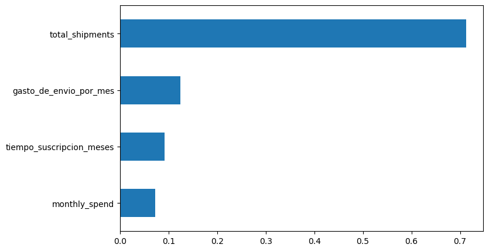
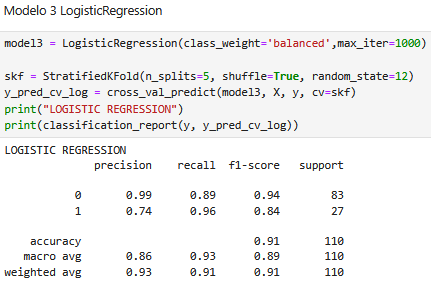
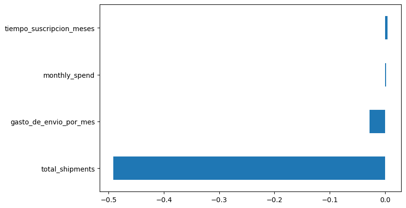

# Predicción de Churn de Clientes

## Descripción
Proyecto de machine learning para predecir churn (deserción) de clientes para una empresa lider en servicios de mensajería, logística y transporte de mercancías a partir de ténicas de machine learning desarrollado en Python.

## Objetivo
Reducir el churn de clientes e identificar las causas que lo genenran.

---
## Metodología
### Preprocesamiento
- Fuente datos:raw_data_customers.csv, consta de 114 registros y 10 varibles. En términos generales se tienen variables que caracterizan a los clientes como por ejemplo fecha de inscripción, fecha de última compra, gasto mensual, total de envíos y la variable churn (con valores de 1: desertó y 0: no desertó).

  
- Limpieza de valores nulos: Se realizó limpieza de valores adicionando 0 las variables monthly_spend y total_shipments. Además, aquellso registros que reportaban con valor de 99999 fue reemplazado por 0.
- Imputación de datos: La variable Churn evidenció un registro nulo, el cual fue reemplazado por el estadístico de moda.
- Transfomación de datos: Las variables de fecha signup_date y last_purchase_date se les realizó un procesamiento para estandarizar fechas en el formato YYYY-MM-DD. Por último, las variables monthly_spend y total_shipments se transformó con valor absoluto con el fin de arrelgar los valores negativos.
- Creación de variables derivadas: se crearon las variables de "tiempo_suscripcion_meses" y gasto_de_envio_por_mes. 

-Análisis exploratorio de datos:

Las variables numéricas 'monthly_spend', 'total_shipments', 'tiempo_suscripcion_meses','gasto_de_envio_por_mes' al ser graficadas mediante un histograma evidenciaron una posible distribución no normal, como tambíen una gran presencia de valores atípicos y extremos, como se muestra a continuación:

Se realiza la prueba de correlación de Spearman entre las variables numéricas ya que no existe normalidad entre ellas. Los resultados arrojan correlación fuerte entre "total_shipments" y "monthly_spend", lo que indica una relación directamente proporcional. Es decir, a medida que aumenta "total_shipments" también aumenta "monthly_spend". Los demás pares de variables presentan correlación débil.

Se toma la variable objetivo "Churn" vs las demás variables numéricas para detallar comportamientos. La relación entre "monthly_spend" y "Churn" , "total_shipments" y "Churn" son diferenciadoras ya que permite identificar valores muy bajos de la mediana se identifican las personas con "Churn"=1 (desertores). Es decir personas que gastan menos mensualmente o personas que envían poco son las más propensas a desertar. "tiempo_suscripcion_meses" y churn no presentan diferenncias significativas.

- Separación de variables X e y: Se crea una muestra train y test con tamaño del 20%, con la opción de estratificada (tiene en cuenta desbalanceo) y semilla aleatoria 123. La relación de no churn es de 83 (75.45%), mientras que churn es de 27 (24.54%) lo que genera un desbalanceo al momento de implementar un modelo de machine learning.

---

### Modelos utilizados

Antes de dar incio a la etapa de modelado se tomó la función de StandarScaler, la cual estandariza los registros de las variables categóricas de la siguiente manera: $z = \frac{x - \mu}{\sigma}$. Además, se considerará las métricas recall, F1 como criterio de mejor modelo.

A continuación, se proponen los siguientes modelos:

- Gradient Boosting.

Importancia de variables:

- Random Forest
  

Importancia de variables:

- Regresión logística (balanced)

---

###  Resultados
* El modelo Random Forest es la mejor alternativa ya que tiene una similitud entre f1-socre y recall de 0.85.
* El modelo Gradient Boosting presenta una baja comparación con Random Forest, ya que f1 score y rcall es de 0.74, por lo tanto es el segundo mejor modelo.
* El modeo de regresión logística no presenta un balance entre recall y f1 ya que sus valore son 0.96 y 0.84, por lo tanto sería una opción descartable.

---

###  Insights
* El análisis exploratorio de datos entre churn y las variables total_shipments(total de envíos) y monthly_spend (gasto mensual), son un diferenciador enorme al comparar clientes desertores y no desertores.
* Clientes con bajo gasto mensual y pocos envíos son los perfiles más representativos con una alta probabilidad de churn. 

---
## Recomendaciones

* Realizar campañas de mercadeo enfocadas a la retención de clientes que representan bajo gasto y poca actividad en envíos.
* Diseñar esrtategias que sean de impacto a partir de promociones, regalos, inscripciones, cupones, descuentos lo que generaría un crecimiento en el uso del servicio

---

##  Cómo ejecutar
pip install -r requirements.txt  
jupyter notebook P_Inter.ipynb
